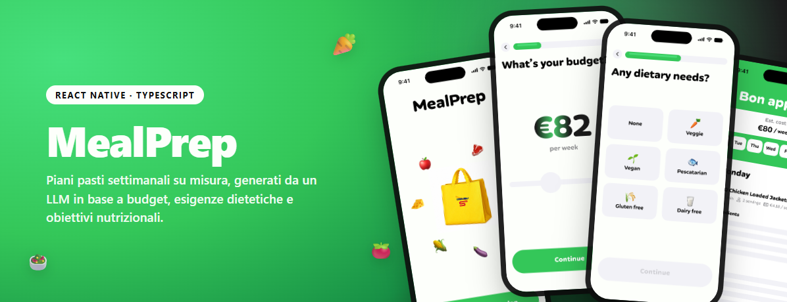

# MealPrep



Take-home per la posizione di Mobile Software Engineer @ Blackboard Studio.

MealPrep è un'app React Native (bare CLI, TypeScript) che guida l'utente attraverso un flusso di 5 schermate per generare, tramite un workflow LLM, un piano pasti settimanale su misura in base a budget, esigenze dietetiche e obiettivi nutrizionali.

## Indice

1. [Cosa fa l'app](#cosa-fa-lapp)
2. [Come si avvia](#come-si-avvia)
3. [Dipendenze principali](#dipendenze-principali)
4. [Architettura](#architettura)
5. [Flusso e feature richieste dall'assegno](#flusso-e-feature-richieste-dallassegno)
6. [Feature extra (oltre l'assegno)](#feature-extra-oltre-lassegno)
7. [Struttura del progetto](#struttura-del-progetto)
8. [Documentazione aggiuntiva](#documentazione-aggiuntiva)

## Cosa fa l'app

L'utente apre l'app, sceglie un budget settimanale, eventuali esigenze dietetiche (es. vegetariano, senza glutine) e obiettivi nutrizionali (es. ricco di proteine, povero di zuccheri), e riceve un piano pasti di 7 giorni — colazione, pranzo e cena per ogni giorno — generato da un LLM (OpenAI) a partire dal catalogo prodotti Esselunga fornito. Ogni pasto mostra ingredienti, ricetta passo-passo, tempo di preparazione e costo. Da lì l'utente può anche generare la lista della spesa aggregata di tutta la settimana.

## Come si avvia

Requisiti: Node.js ≥ 22.11, un ambiente React Native funzionante (Android SDK + emulatore, oppure Xcode + simulatore iOS).

```bash
npm install
```

Poi creare un file `.env` nella root del progetto (ignorato da git) con la propria chiave OpenAI, necessaria per generare il piano pasti via LLM:

```
OPENAI_API_KEY=sk-...
```

Infine avviare l'app:

```bash
npm run android        # oppure: npm run ios
```

Per il bundler in isolamento: `npm start`. Per i test: `npm test`. Per il lint: `npm run lint`.

## Dipendenze principali

| Libreria | Scopo |
|---|---|
| `react` / `react-native` | Framework UI e runtime nativo (bare CLI, non Expo) |
| `@react-navigation/native` + `native-stack` | Navigazione tra le 5 schermate del flusso + modale Lista della spesa |
| `jotai` | State management atomico (stato client) |
| `@tanstack/react-query` + `jotai-tanstack-query` | Server-state: chiamata LLM come query cacheata/reattiva, esposta come atomo |
| `jotai-family` | Atomi parametrizzati dove serve |
| `react-native-svg` | Grafica vettoriale (es. testo con gradiente nella schermata Budget) |
| `@react-native-community/slider` | Base dello slider budget (con traccia personalizzata sopra, vedi decisioni sotto) |
| `react-native-safe-area-context` | Gestione corretta degli insets su Android edge-to-edge / iOS notch |
| `react-native-gesture-handler` / `react-native-screens` | Richiesti da React Navigation per gesture e performance nativa |
| `react-native-html-to-pdf` + `react-native-share` | Esportazione della lista della spesa in PDF e condivisione tramite lo share sheet nativo |

Il catalogo prodotti (`product_catalog_en.json`, ~3.2 MB) è incluso in `src/Assets/data/` e caricato interamente client-side, come indicato nel brief ("everything can be done client-side").

## Architettura

Il codice segue un pattern **MVVM a 5 livelli**, applicato in modo identico a ogni feature sotto `src/Core/features/<NomeFeature>/`:

```
features/NomeFeature/
├── State/          → atomi Jotai (stato primitivo + query/mutation)
├── Controller/      → hook use*Controller: solo callback (handleX), nessun dato in output
├── ViewModel/        → classe con funzione statica pura *ViewModel.create(): input → DTO
├── ScreenLoader/     → orchestratore: legge gli atomi, chiama il ViewModel, inietta le props
└── View/
    ├── Components/  → componenti presentazionali isolati
    └── Screens/     → schermata principale, riceve tutto via props (nessun atomo, nessun useEffect di fetch)
```

Un paio di punti chiave. Il ViewModel è puro: non è un hook né un atomo, quindi è testabile in isolamento senza dover montare React. La generazione del piano pasti è invece un `atomWithQuery` (`mealPlanQueryAtom`), quindi la query LLM si attiva automaticamente alla sottoscrizione e viene cacheata, senza bisogno di alcun `useEffect` per lanciarla. La navigazione tra le schermate è gestita da uno stack di `@react-navigation/native-stack` con header nascosto (`headerShown: false`, ogni schermata gestisce la propria UI), definito in `src/Core/Navigation/RootNavigator.tsx`.

Documentazione di dettaglio in `docs/` (vedi sezione [Documentazione aggiuntiva](#documentazione-aggiuntiva)).

## Flusso e feature richieste dall'assegno

Le 5 schermate del flusso core, come da specifica:

1. **Lander** (`Lander`) — schermata di apertura; asset ed emoji al centro personalizzati con un'animazione di rotazione a orbita (parte lasciata libera dal brief).
2. **Budget Selection** (`BudgetSelection`) — slider per il budget settimanale, range **25–150 €**. Lo slider nativo non permette di controllare lo spessore della traccia, quindi sopra a uno slider reso trasparente (solo per thumb/touch) è disegnata una traccia personalizzata (due `View` assolute: sfondo + riempimento proporzionale al valore).
3. **Dietary Needs** (`DietaryNeeds`) — esigenze dietetiche: Nessuna, Vegetariano, Vegano, Pescetariano, Senza glutine, Senza lattosio. Ogni opzione è mappata su un filtro reale del catalogo (`src/Core/Catalog/dietaryNeeds.ts`): label positive del prodotto (es. "Vegetarian"), allergeni da escludere (es. "Glutine", "Latte"), o reparti da escludere (es. Pescetariano esclude i reparti carne/salumi ma include il pesce).
4. **Nutritional Goals** (`NutritionalGoals`) — obiettivi nutrizionali: Ricco di proteine, Povero di zuccheri/grassi/carboidrati/sale. Anche qui ogni opzione è una soglia reale sui valori nutrizionali per 100g del prodotto (`src/Core/Catalog/nutritionalGoals.ts`).
5. **Weekly Meal Plan** (`MealPlan`) — piano di 7 giorni generato via LLM (OpenAI, workflow in `src/Core/Llm/mealPlanWorkflow.ts`). Il catalogo viene prima filtrato lato client secondo le esigenze/obiettivi selezionati, poi ridotto a un sottoinsieme rappresentativo (max 25 prodotti per reparto, 220 totali) per stare in un budget di token ragionevole; il prompt impone: piano interamente in italiano, uso esclusivo di `productId` reali dal sottoinsieme, `totalPrice` entro il budget scelto, e **3 pasti a giorno** (colazione/pranzo/cena, oltre il minimo di 1/giorno richiesto dal brief) con convenzioni italiane (niente pasta a colazione). Ogni pasto mostra nome, tipo pasto, tempo di preparazione, porzioni, prezzo, ingredienti e ricetta passo-passo. La navigazione tra i pasti dello stesso giorno avviene con swipe orizzontale sulla card; le linguette in alto cambiano giorno, con selezione automatica del giorno corrente all'apertura.

## Feature e decisioni extra

Non richieste dal brief, aggiunte come miglioramento del flusso.

La **lista della spesa aggregata** (`ShoppingList`, icona 🛒 in alto a destra su MealPlan) somma automaticamente le quantità dello stesso ingrediente usato in più ricette della settimana, ad esempio il salmone che compare in due pasti diversi finisce in un'unica riga con il totale in grammi. Le righe sono raggruppate per reparto del supermercato seguendo l'ordine tipico di percorrenza (frutta e verdura, panetteria, latticini, carne, e così via fino all'infanzia), e ognuna può essere spuntata, con il testo che viene barrato alla selezione.

Dalla stessa schermata è possibile esportare la lista in **PDF** tramite `react-native-html-to-pdf`, che apre poi lo share sheet nativo (`react-native-share`) per salvarlo o inviarlo.

Ogni pasto ha anche due pulsanti **mi piace / non mi piace** sotto la ricetta. Al momento è solo mock a livello di UI: il feedback viene tenuto in un atomo locale (`mealFeedbackMapAtom`) e mostrato visivamente, ma non influenza ancora la generazione del piano. L'idea è di usarlo in futuro come base per una funzione di raccomandazione, così che una ricetta segnata come "non mi piace" non venga più riproposta nelle generazioni successive (passandola come vincolo di esclusione al prompt LLM), ma questa parte non è ancora implementata.

Un'altra scelta fatta rispetto al brief riguarda il modo in cui si scorrono i pasti della giornata: invece di far navigare l'utente da un giorno all'altro per vedere colazione, pranzo e cena, i tre pasti sono presentati come una card scorrevole orizzontalmente (swipe), mentre le linguette in alto restano dedicate al cambio giorno. All'apertura della schermata il piano si posiziona già sul giorno corrente, senza bisogno di cercarlo manualmente tra i sette.

## Struttura del progetto

```
src/Core/
├── features/          → una cartella per schermata/feature, pattern MVVM a 5 livelli (vedi sopra)
│   ├── Lander/
│   ├── BudgetSelection/
│   ├── DietaryNeeds/
│   ├── NutritionalGoals/
│   ├── MealPlan/
│   └── ShoppingList/
├── Navigation/         → RootNavigator, definizione rotte (routes.ts)
├── Catalog/            → accesso al catalogo prodotti + filtri per esigenze dietetiche/obiettivi nutrizionali
├── Llm/                → client OpenAI, schema JSON del piano pasti, prompt/workflow di generazione
└── Theme/              → colori, spaziature, tipografia condivisi
```

## Documentazione aggiuntiva

1. `docs/02-mvvm-architecture.md`, il dettaglio del pattern MVVM a 5 livelli e delle convenzioni sui form. Sono linee guida architetturali generali del team, non tutte specifiche a questo progetto: ad esempio gli esempi di validazione form non si applicano qui, non essendoci form con Zod in MealPrep.
2. `docs/04-tanstack-query-patterns.md`, `docs/05-loadable-state.md` e `docs/06-view-file-organization.md`, che raccolgono le convenzioni correlate su query, stati di caricamento e organizzazione dei file di View.
3. `log/CONVERSATION_LOG.md`, il log delle sessioni di sviluppo assistito da Claude Code su questo progetto.
4. `utilsDoc/README.pdf`, il brief originale dell'assegno.
