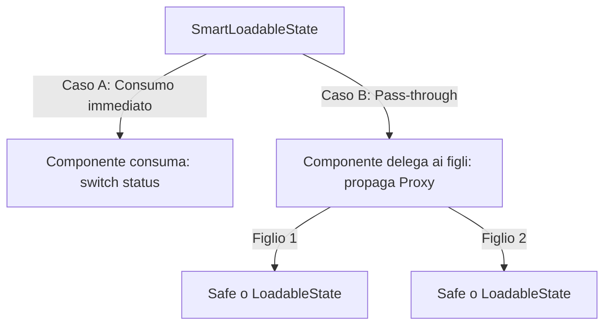

# 🚦 Pattern LoadableState & Proxy

Il pattern **LoadableState** fornisce una gestione elegante, tipizzata e priva di boilerplate per risorse asincrone, con propagazione ricorsiva dello stato tramite Proxy JavaScript.

Il codice sorgente si trova in [`src/Commons/LoadableState/loadableState.ts`](../LoadableState/loadableState.ts).

---

## 1. Definizione degli Stati

* **`LoadableState<T>`** (A tre stati):
  Rappresenta una risorsa che può fallire. Include lo stato di `loading`, `error` (con messaggio) e `success` (con dati `T` e booleano `isFetching` per rinfreschi silenziosi).
* **`SafeLoadableState<T>`** (A due stati):
  Esclude lo stato di errore. Utilizzato nei componenti foglia dove l'errore è già stato centralizzato e gestito a monte dal genitore.

```typescript
export type LoadableState<T> =
  | { readonly status: 'loading' }
  | { readonly status: 'error'; readonly error: string }
  | { readonly status: 'success'; readonly data: T; readonly isFetching: boolean };

export type SafeLoadableState<T> =
  | { readonly status: 'loading' }
  | { readonly status: 'success'; readonly data: T; readonly isFetching: boolean };
```

---

## 2. Propagazione Ricorsiva via Proxy (`SmartLoadableState`)

Grazie all'uso di un **Proxy JavaScript ricorsivo**, accedendo ad una qualsiasi sotto-proprietà annidata di uno `SmartLoadableState<T>`, questa viene valutata a runtime e a compile-time come un sotto-stato asincrono coerente con lo stato del genitore:
* Se il genitore è in `loading` o `error`, l'accesso a `state.user.address.city` restituisce istantaneamente `{ status: 'loading' }` o `{ status: 'error' }`.
* Se il genitore è in `success`, restituisce `{ status: 'success', data: parent.user.address.city, isFetching: parent.isFetching }`.

---

## 3. Utility Functions

### `queryToLoadableState`
Converte il risultato di un `atomWithQuery` in un `LoadableState`:
```typescript
const invoicesState = queryToLoadableState(
  mainQuery,
  (data) => ({ invoices: data.invoices, totalItems: data.totalItems }),
  "Errore di caricamento fatture"
);
```

### `deferLoadableProperties`
Avvolge un `LoadableState` in un Proxy ricorsivo restituendo uno `SmartLoadableState`:
```typescript
const smartInvoicesState = deferLoadableProperties(invoicesState);
// ora smartInvoicesState.invoices è a sua volta un LoadableState<Invoice[]>
```

### `assertSafeLoadable`
Converte un `LoadableState<T>` in `SafeLoadableState<T>` lanciando un errore runtime se lo stato è `error`:
```typescript
const safeState = assertSafeLoadable(loadableState);
// safeState è SafeLoadableState<T> — TypeScript non vede più il case 'error'
```

---

## 4. Flessibilità e Delegazione delle Responsabilità

Il pattern è una filosofia generale di **delega asincrona**: qualsiasi componente può decidere autonomamente se consumare lo stato o delegarlo.



### Regola di Consumo
* **Se un componente ha bisogno dei dati** per eseguire calcoli, condizionare il JSX o formattare variabili → deve consumare lo stato con `switch`.
* **Se un componente si occupa solo del layout o del pass-through** → non spacchetta lo stato, lo inoltra come Proxy ai sotto-componenti.

---

## 5. Propagazione Flessibile degli Errori

Non è obbligatorio che il contenitore gestisca l'errore a livello globale. Esistono due scenari:

### Scenario Safe (Errore Centralizzato)
Il contenitore cattura l'errore. I figli ricevono solo `SafeLoadableState<T>` (gestendo solo `loading` e `success`):
```typescript
const safeState = assertSafeLoadable(loadableState);
// passa safeState ai figli → non devono gestire 'error'
```

### Scenario Standard (Errore Distribuito/Locale)
Il contenitore non gestisce l'errore. I figli ricevono `LoadableState<T>` completo e lo gestiscono localmente:
```tsx
const LocalCeoCard: React.FC<{ ceoState: LoadableState<CEO> }> = ({ ceoState }) => {
  switch (ceoState.status) {
    case 'loading':
      return <CeoCardSkeleton />;
    case 'error':
      return <CeoCardError error={ceoState.error} />;
    case 'success':
      return <CeoCardView ceo={ceoState.data} isFetching={ceoState.isFetching} />;
  }
};
```

---

## 6. Regola d'Oro MVVM: Instanziazione Esclusiva nel ViewModel

* **Lo ScreenLoader è Agnostico**: Non importa `LoadableState`, `SafeLoadableState` o `deferLoadableProperties`. Legge i dati grezzi e li passa al ViewModel come `QueryResultLike<T>`.
* **Il ViewModel è il Creatore**: È responsabilità esclusiva del ViewModel convertire i dati grezzi in `SmartLoadableState` tramite `queryToLoadableState` e `deferLoadableProperties`.

---

## 7. Regole di Dipendenza dello Stato

1. **Dipendenza dal Caricamento**:
   Se un dato o flag (es. `hasNextPage`, `isFetchingNextPage`) dipende da un caricamento asincrono, **deve essere passato alla View all'interno di un `LoadableState`** — non come proprietà libera radice del DTO. Può essere nello stesso `LoadableState` del dato principale oppure in uno separato.

2. **Un LoadableState per ogni Caricamento Indipendente**:
   Deve esistere almeno un `LoadableState` univoco per ciascun processo di caricamento indipendente (es. query paginata e query infinite scroll → due `LoadableState` distinti).

---

## 8. Vantaggi Architetturali

1. **Nessuno Sfarfallio**: Il campo `isFetching` nello stato `success` gestisce i rinfreschi in background senza distruggere la UI.
2. **Skeleton Screens Parziali**: Ogni componente decide la propria UX di caricamento.
3. **Type Safety Statica**: I blocchi `switch` esaustivi + `noFallthroughCasesInSwitch` garantiscono la copertura di tutti gli stati.
4. **Isolamento Grafico**: La scomposizione in `View`, `Skeleton` e `Error` permette di testare ed evolvere le interfacce in modo atomico.
